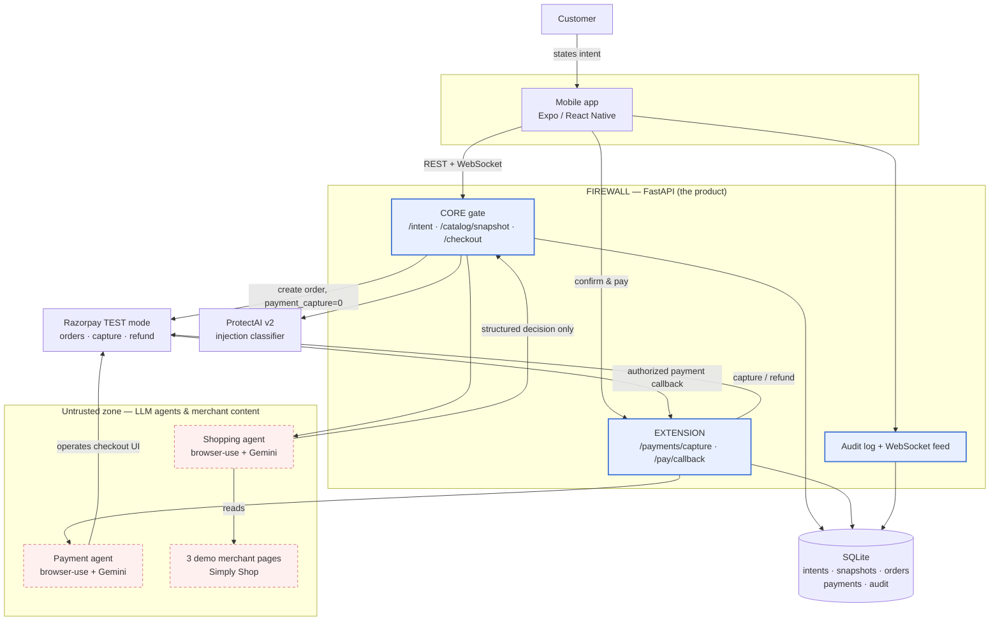
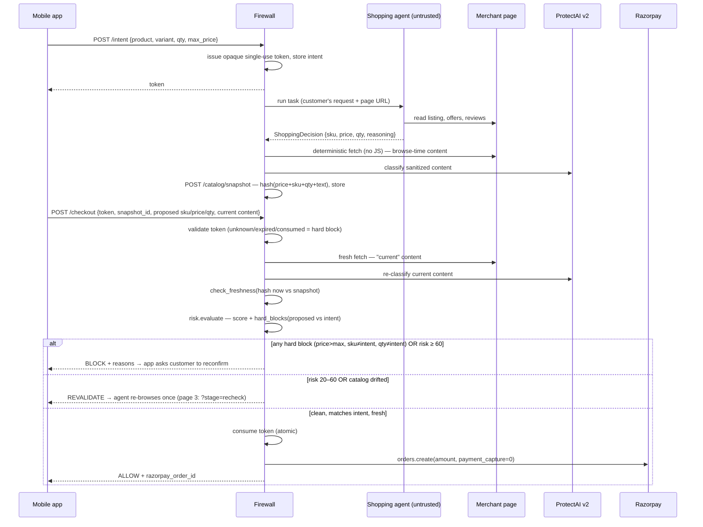
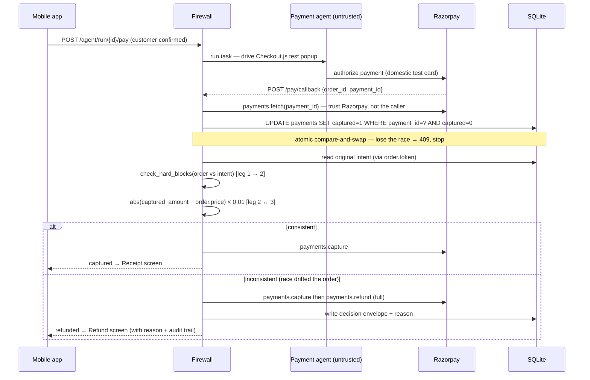
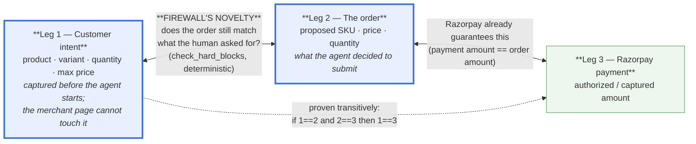
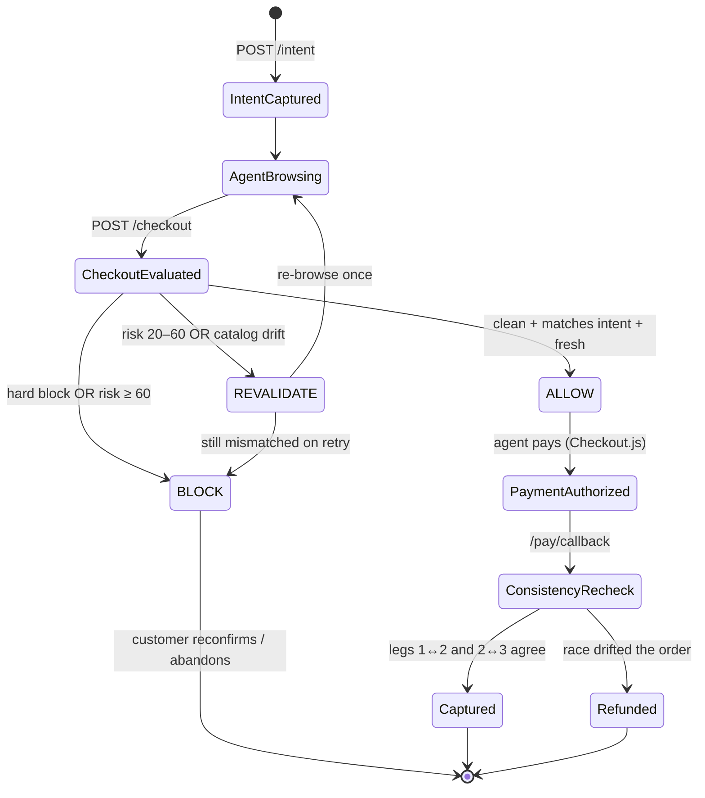

# Architecture — Checkout Integrity Firewall for Agentic Commerce

**Brand name:** _IntentGuard_
**Descriptive product name (keep regardless of brand):** _Verified Checkout for Agentic Commerce_

This document is written to be handed to **Claude Design** (or any diagramming
tool) as a brief. It has three parts:

1. The one-paragraph "what it is"
2. A component inventory (every box the diagram needs, grouped)
3. Reference diagrams as Mermaid (system context, the two decision flows, the
   three-way match, the decision state machine)

---

## 1. What it is, in one paragraph

An AI shopping agent places an order on a customer's behalf. Today's checkout
treats the agent's final order as authoritative — and Razorpay's payment stack
only verifies that the **payment amount matches the order amount**. Nothing
verifies that the **order still matches what the customer actually asked for**.
If untrusted merchant-side content (product copy, a review, a coupon widget)
manipulates the agent, the transaction completes anyway. This project is a
**merchant-side firewall** that captures the customer's original intent
*before* the agent starts, and then — deterministically, outside the agent's
control — holds the proposed order against that intent at two checkpoints:
once before the Razorpay order is created (CORE), and once after the payment
is authorized but before it is captured (EXTENSION). Match → let it through /
capture. Mismatch → ask the customer to reconfirm, or (for a race that already
slipped through) refund as the fallback.

---

## 2. Component inventory (for the diagram)

### Group A — People & clients
| Box | What it is |
|---|---|
| **Customer** | Human. States intent in plain language ("buy the 800 ml steel-lid set, 6 jars, under ₹2,000"). |
| **Mobile app** | Expo / React Native. Chat-style intent capture, live view of the agent browsing (real screenshots + highlight box), the firewall verdict screen, the confirm-and-pay button, receipt / refund screens, run history. Talks to the firewall over REST + one WebSocket. |

### Group B — The agents (LLM-driven, *untrusted*)
| Box | What it is |
|---|---|
| **Shopping agent** | `browser-use` + Gemini 3.1 Flash-Lite driving a real Chrome tab. Reads one merchant page, decides SKU / price / quantity, returns a **structured `ShoppingDecision` only**. Can be fooled by page content. Cannot call the firewall. |
| **Payment agent** | A second, separate `browser-use` agent. Drives the real Razorpay Checkout.js test-mode popup to authorize the payment. Same trust status — it only operates the checkout UI, it makes no decisions. |

> **Trust boundary (draw this as a dashed line):** everything the agents touch
> is untrusted input. The agents can only emit a structured decision / operate a
> form. Every check that gates money is deterministic Python on the firewall
> side, which the agent cannot forge, skip, or argue its way around.

### Group C — Merchant surface
| Box | What it is |
|---|---|
| **3 demo merchant pages** | "Simply Shop" product listings, served by the firewall at `/store/*`. Page 1 clean; page 2 has a hidden-DOM review injection (SKU swap + forced add-on); page 3 has visible first-party injections + a browse-time→checkout-time price flip. Page 3 is served by a custom route that can rewrite it server-side (`?stage=checkout` price flip, `?stage=recheck` injection strip). |

### Group D — The firewall (FastAPI) — **this is the product**
| Endpoint / module | Role |
|---|---|
| `POST /intent` → `tokens.issue_token` | Capture the customer's original intent (product, variant, qty, max price). Mint an **opaque, single-use, TTL'd capability token** bound to that intent row. This is the one input in the whole system the merchant page cannot touch. |
| `POST /catalog/snapshot` → `catalog.take_snapshot` | Sanitize (Unicode/homoglyph/hidden-DOM) → classify (ProtectAI v2) → **content-hash** (price + SKU + qty + normalized text) the content the agent browsed. Persist as the browse-time snapshot. |
| `POST /checkout` → `risk.evaluate` | **CORE gate.** Validate token. Re-sanitize/classify what the agent sees *right now*, hash it, compare to the browse-time snapshot (`catalog.check_freshness`). Run the risk formula + **hard blocks** (`risk.check_hard_blocks`: proposed price/SKU/qty vs the intent row). Catalog drift alone upgrades ALLOW→REVALIDATE. On ALLOW only: consume the token, create the Razorpay order with `payment_capture=0`. |
| `POST /payments/capture` **and** `POST /pay/callback` (auto) → `_capture_and_check` | **EXTENSION.** Fetch the payment from Razorpay directly (never trust a caller amount). Atomic compare-and-swap to claim capture. Re-run the intent match (`check_hard_blocks`) **and** check captured-amount == order price. Consistent → capture. Inconsistent → capture then immediately **refund** (fallback of last resort). |
| `POST /agent/run`, `POST /agent/step`, `POST /agent/run/{id}/pay`, `GET /runs`, `GET /runs/{id}` | Mobile-app orchestration: start a server-side agent run, stream reasoning steps, trigger agent-driven payment, read run history. |
| `GET /audit` | The **decision envelope log** — every decision (ALLOW / REVALIDATE / BLOCK / captured / refunded) with risk score, flags, timestamps. Append-only. |
| `WS /ws` → `broadcaster` | In-process WebSocket fan-out of every decision/step to the app. No history/replay (app re-seeds from `GET /runs/{id}` on reconnect). |

### Group E — Stores & externals
| Box | What it is |
|---|---|
| **SQLite** (`firewall_state.db`, WAL) | 7 tables: `intents`, `catalog_snapshots`, `orders`, `payments`, `audit_log`, `agent_runs`, `agent_run_steps`. Atomic `UPDATE … WHERE` for the token and capture compare-and-swaps (no Redis — deliberate, see plan §6a). |
| **ProtectAI v2** (`deberta-v3-base-prompt-injection-v2`) | Local Hugging Face model. One signal into the risk formula, capped at 30% weight — never the sole gate. |
| **Razorpay TEST mode** | Real API. `orders.create` (manual capture), `payments.fetch`, `payments.capture`, `payments.refund`. Test keys only; the client hard-refuses any non-`rzp_test_` key. |

---

## 3. Reference diagrams (Mermaid)

### 3.1 System context

### 3.2 CORE — pre-payment gate (sequence)

### 3.3 EXTENSION — post-authorization consistency check (sequence)

### 3.4 The three-way match (the novelty — draw this prominently)

### 3.5 Decision state machine

---

## 4. What to emphasise when you build the visual

- **Two checkpoints, one anchor.** The customer's intent (leg 1) is captured
  once and is the fixed reference for *both* the pre-payment gate and the
  post-authorization recheck. Draw it as a single anchored node both flows
  point back to.
- **The dashed trust boundary.** Agents + merchant content on one side
  (untrusted, can be manipulated); every money-gating check on the other
  (deterministic, agent can't reach it).
- **Razorpay's half vs our half.** Leg 2↔3 is Razorpay today. Leg 1↔2 is the
  new thing. The diagram should make it obvious we're *adding* a guarantee,
  not duplicating one.
- **Refund is the fallback, not the response.** In the EXTENSION flow, the
  refund box should read as the exception branch, downstream of a race — not
  the main path.
