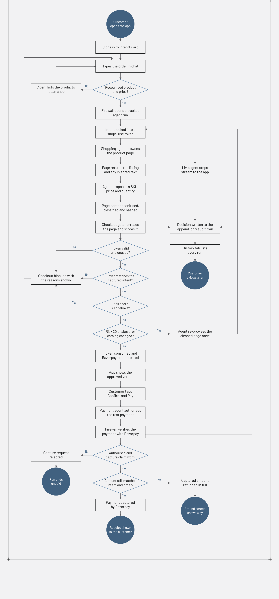

# IntentGuard

**Checkout Integrity Firewall for Agentic Commerce**

AI shopping agents now place orders on a customer's behalf. Today's checkout
stack only verifies that the *payment amount matches the order amount* — it
has no way of knowing whether the *order itself* still matches what the
customer actually asked for. If untrusted merchant-side content (product
copy, a planted review, a coupon widget) manipulates the agent mid-browse,
the transaction completes anyway.

IntentGuard is a merchant-side firewall that sits between the shopping agent
and the payment gateway. It captures the customer's intent before the agent
starts browsing, then - deterministically, outside the agent's control —
holds the agent's proposed order against that intent at two checkpoints:
once before the order is created, and once after payment is authorized but
before it's captured.

## How it works

- **Intent capture** : the customer states what to buy (product, variant,
  quantity, max price) before the agent starts browsing. This is locked in
  as a single-use capability token.
- **Pre-payment gate** : before `POST /v1/orders`, the proposed order is
  checked against the captured intent *and* against a fresh, hashed snapshot
  of the product page the agent read. Merchant content is also scanned for
  injected instructions. Result: **allow**, **revalidate**, or **block**.
- **Post-authorization recheck** : after the payment is authorized but before
  it's captured, product/order state is re-verified. If it drifted during
  payment, the payment is refunded in full rather than captured.
- **Audit log** : every decision (allowed or not) writes an immutable,
  never-edited row, streamed live over a WebSocket.

## Workflow



The firewall runs as a FastAPI service between three untrusted, LLM-driven
surfaces (the mobile app's chat, the shopping agent, and the payment agent)
and two deterministic stores (SQLite for intents/orders/audit, and a
prompt-injection classifier for scoring page content). It talks to Razorpay
in test mode to create orders, capture payments, and issue refunds.

## System Architecture


The firewall sits between three untrusted, LLM-driven surfaces and two deterministic backends. The customer states intent (product, variant, qty, max price) to the mobile app, which hands off the task to a Gemini-driven shopping agent running in a real Chrome tab. The agent reads the merchant page - including third-party content like reviews — and proposes an order back to the firewall.

The checkout integrity firewall never trusts the agent's output directly:

Intent capture locks in what the customer actually asked for before the agent starts browsing.
Pre-payment gate compares the proposed order against that captured intent and against a hash of the page the agent read, then returns allow, revalidate, or block.
Once confirmed, the firewall creates the RazorPay order and a separate payment agent authorizes payment.
Post-authorization recheck re-verifies product/order state after authorization but before capture - if anything drifted, the payment is refunded in full instead of captured.
Every decision is written once to an audit log and streamed live back to the mobile app.

State lives in SQLite (intents, snapshots, orders, audit), page content is scored by an injection classifier, and payments run against RazorPay in test mode — no real money moves.

## Repository structure

```
firewall/       FastAPI middleware - intent capture, pre-payment gate,
                post-authorization recheck, audit log, WebSocket broadcast,
                Razorpay client, SQLite store, deterministic sanitizer +
                ML prompt-injection classifier.
agent/          Demo shopping agent: a browser-use + Gemini agent that
                browses one merchant page and returns a structured
                purchase decision. Never calls the firewall directly.
mobile-app/     Expo / React Native app - intent capture chat, live agent
                view, verdict screen, confirm-and-pay, receipts/refunds,
                run history.
demo/merchant/  Three static "Simply Shop" product pages (clean + two
                poisoned variants) the demo agent browses.
eval/           Real-data-only labeled dataset + fetch scripts used to
                measure the firewall's own precision/recall.
run_eval.py     Runs the sanitizer + classifier pipeline over eval/eval_set.jsonl
                and reports precision/recall/false-positive-rate.
```

## Running it

### 1. Firewall service

```bash
python -m venv .venv
source .venv/bin/activate        # .venv\Scripts\activate on Windows
pip install -r requirements.txt
cp .env.example .env             # fill in Razorpay test-mode keys + an LLM key
cd firewall
uvicorn main:app --reload
```

### 2. Demo shopping agent

With the firewall running on `:8000` (and a real Chrome/Chromium installed —
confirm with `browser-use --doctor`):

```bash
cd agent
python run_demo.py 1          # clean page -> expect ALLOW
python run_demo.py 2          # hidden-review injection -> expect BLOCK
python run_demo.py 3          # visible injection -> expect REVALIDATE
python run_demo.py 3 --drift  # + simulate a browse->checkout price flip
```

### 3. Mobile app

```bash
cd mobile-app
npm install
npm start
```

### 4. Evaluation

```bash
python run_eval.py
```

## Configuration

See `.env.example` for the full list. At minimum you need:

- `RAZORPAY_KEY_ID` / `RAZORPAY_KEY_SECRET` — Razorpay **test mode** keys
- `GEMINI_API_KEY` (or `GROQ_API_KEY` if `LLM_PROVIDER=groq`) — for the demo
  shopping agent

No real money moves in any of the above — Razorpay test-mode keys only.
